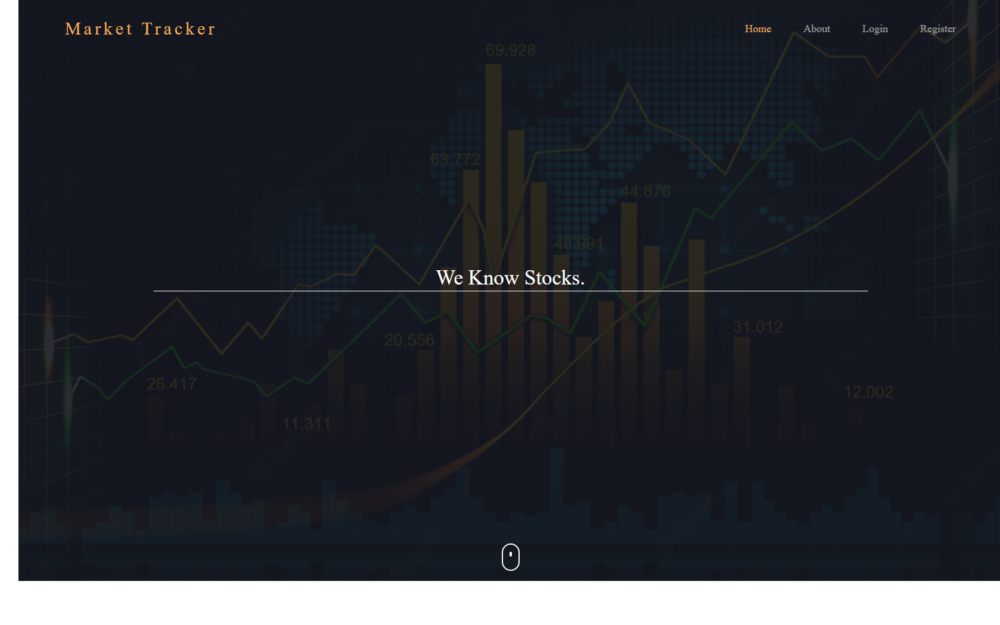

* [General info](#general-info)
* [Technologies](#technologies)
* [Setup](#setup)
* [Application view](#application-view)

## General info
<details>
<summary>The application allows us to track given financial assets (i.e market stocks). With the functionality of 
on-live chatting, blogging, tracking data according to the specified market stocks, customizing own user profile, 
visualizing data on charts with event source.</summary>
</details>

Link to ADRs for the project:
[Link to the documentation repository](https://github.com/WebbErrJF/market_tracker-docs)


## Technologies
<ul>
<li>Django</li>
<li>DRF</li>
<li>JavaScript</li>
<li>HTML5 & CSS3</li>
<li>Django Channels</li>
<li>Celery</li>
<li>Docker, docker-compose</li>
<li>AWS (soon)</li>
</ul>

## Setup
1. Clone the repo
```git clone https://github.com/WebbErrJF/market_tracker.git```

2. Go to the project's directory.
 
3. Run:
```docker-compose up --build```

## Application view
<h3>Homepage</h3>


<h3>Profile</h3>


<h3>Dashboard</h3>
